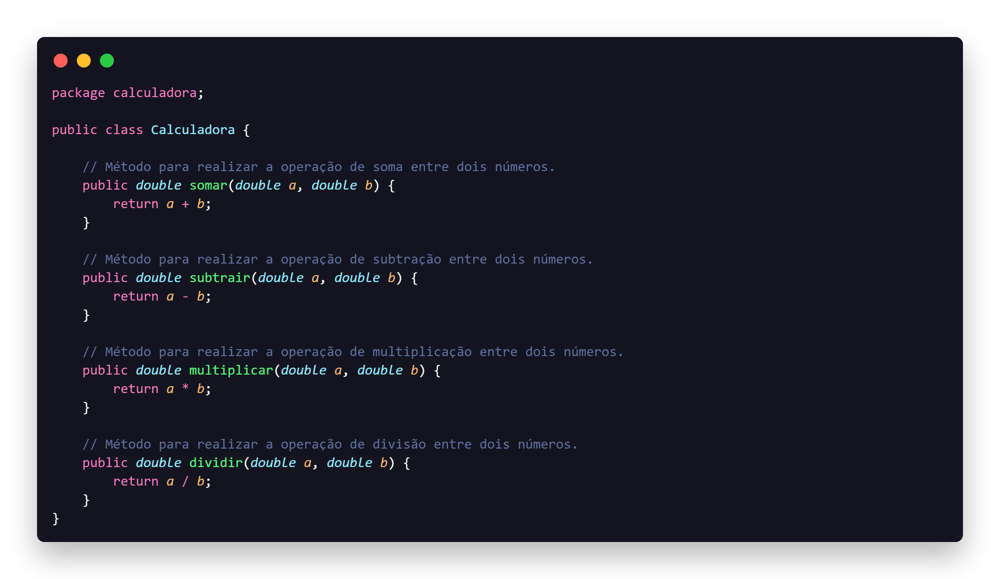
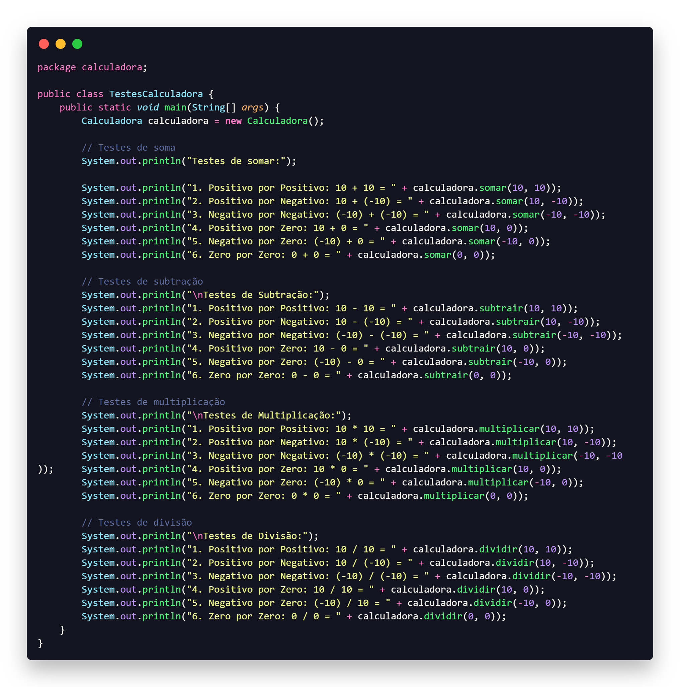

<h1 align="center">AC1 - Planejamento de Testes - Aceitacao e Sistema</h1>
<h2 align="center">Calculadora</h2>

  • <a href="#sobre">Sobre</a> •
  <a href="#tecnologias">Tecnologias</a> •
  <a href="#pré-requisitos">Pré-requisitos</a> •
  <a href="#imagens">Imagens</a> •
  <a href="#autor">Autor</a>

# Sobre

Este é o primeiro projeto da AC1 (Avaliação Continuada 1) da disciplina de Qualidade e Testes de Software, Facens.

O objetivo deste projeto é criar uma calculadora simples em Java que inclui através de métodos as operações de soma, subtração, multiplicação e divisão.

# Tecnologias

 As seguintes ferramentas foram usadas na construção desse projeto:

• Java

# Pré-requisitos

• <a href="https://www.oracle.com/java/technologies/javase-downloads.html">Java Development Kit (JDK)</a>

• Além disto é bom ter um editor para trabalhar com o código como <a href="https://www.eclipse.org/downloads/">Eclipse </a>

# Imagens

# Autor

 JOÃO VICTOR 👋 <a href="https://www.linkedin.com/in/ojoaovictor/"> Entre em Contato!</a> 

